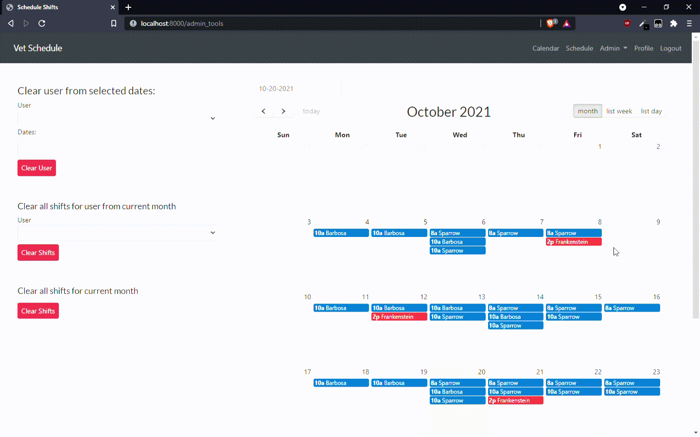
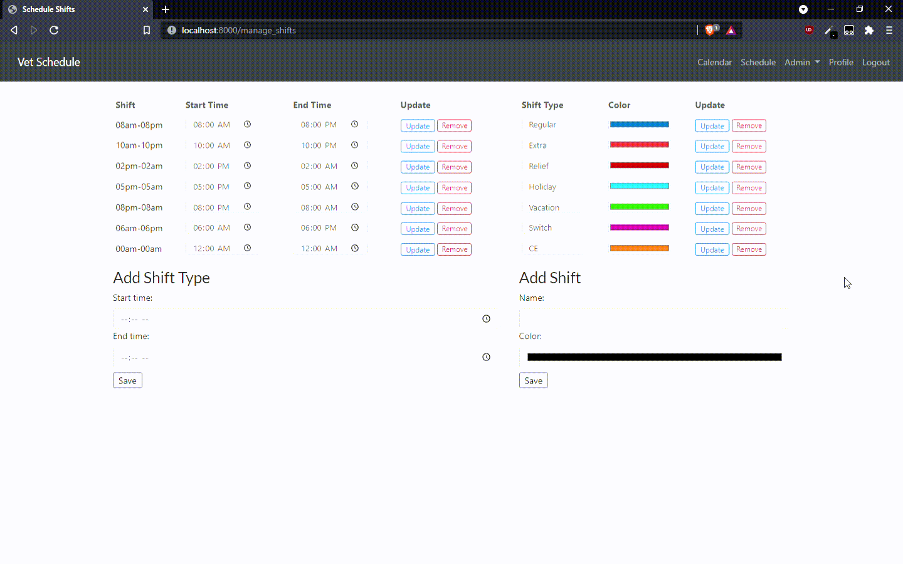

# ShiftScheduler
#### Web-App for planning and scheduling employee shifts powered by Python, Django, and FullCalendar
### Table of Contents
* [General Info](#general-info)
* [Features](#features)
* [Technologies Involved](#technologies-involved)
* [Interface](#interface)
* [Admin Interface](#admin-interface)
---
### General Info
The goal of the project is to provide a simplified and fast way for veterinarian practices (and other businesses) to be able to efficiently schedule staff and customize the calendar to meet the needs of the hospital.  A local veterinary emergency hospital was using calendars built in spreadsheets as their staff schedule.  These spreadsheets were manually created and updated with each staff member having to be individually added for each date they were scheduled to work.  Total shifts had to be manually counted for each staff member for each month and for the full year.  

### Features
Functionality provided for the sponsoring hospital:
- Staff members can be added to multiple dates at once
- Shifts are automatically totaled for each staff member by month and year
- Security provided by requiring staff to register and log in to view schedule
- Shifts can be customized:
  - Start/End time
  - Color
  - Name/Type
- Shifts can be individually edited/deleted once assigned
- Shifts for individual staff can be deleted for selected dates or for an entire selected month
- entire month can be reset with a delete all shifts button
- Staff/Users have individual profiles with contact information
- Admin can reset passwords
- Staff can update passwords
- Staff can view their own shift count by type for each month and year
---
### Technologies Involved
- Python 3.9
- Django 2.2
- FullCalendar v3.1.0
- JavaScript
- Bootstrap v5.0
- Semantic UI v2.2.7
- jQuery v3.5.1
- HTML5
- CSS3
- bCrypt v3.2.0

## Interface
### Normal User Interface
Regular users are able to login and view the schedule in month, week, or day format.  Users can go to their profile page to view only their shifts plus a count of their shifts for the currently displayed month and year. Users may also edit their contact info and even update their password.

## Admin Interface
Administrators are able to do everything a normal user can in addition to being schedule staff members, edit the schedule, add/edit/remove staff from the app, customize the schedule shifts and more.

### Add/Edit/Remove User
Administrators can manage staff using the Manage Vets interface.  Here they can add new users/staff members, edit staff information, and remove staff members from the system.

### Add/Edit/Remove Shifts
Administrators can customize the shifts by start/end time, name/type, and by color using the Manage Shifts interface.

### Scheduling Staff
Administrators can open the schedule view and see a total shift count for all current staff members by month and year.  Here they can also schedule shifts for staff for multiple days at once by selecting the user, the shift, the shift type, and the dates to schedule the user for.

### Admin Tools
Administrators can quickly remove multiple/all shifts for a staff member or clear all shifts from an entire month using the Admin Tools interface.

